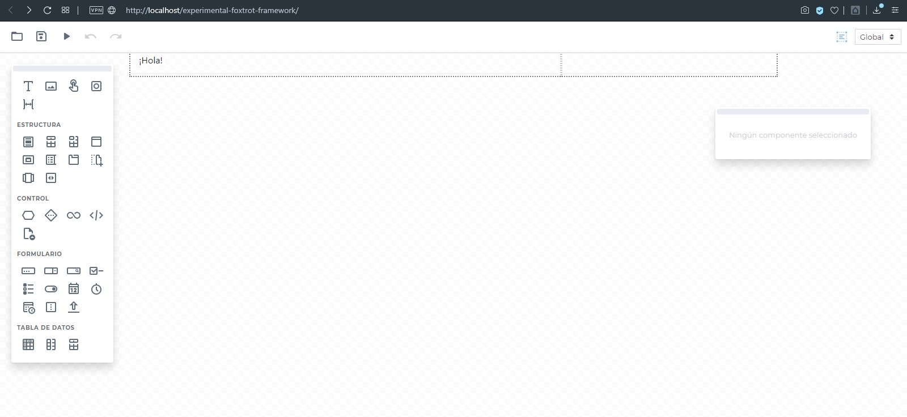

Trabajo en curso y experimentos para el desarrollo de Foxtrot 7 (https://github.com/foxtrotarg/foxtrot-framework) y otros productos. 

### Qué estamos desarrollando

#### Editor

Editor de vistas WYSIWYG: Nuestro editor de vistas viejo trabajaba íntegramente con objetos y cada vista rea dibujada en tiempo de ejecución. En esta versión, buscamos un editor que "compile" la vista, almacenándola en html/css, pero sin perder la relación entre elementos del DOM y los objetos del framework. Debe, además, permitir editar en la versión real de la vista, con todos sus estilos y cualquier otra maquetación que se añada externamente.

El editor se acerca a su versión final. En líneas generales, falta (entre otros detalles y TODOs):
- Cortar, copiar, pegar.
- Al arrastrar sobre un componente, deben aparecer las áreas a su alrededor para poder soltar arriba/a la izquierda o abajo/a la derecha del mismo.
- Selección múltiple.
- Barra de formatos (negrita, cursiva, etc.) al editar textos.
- Determinar si un elemento puede ser hijo o no de otro al arrastrar y soltar (actualmente cualquier componente puede soltarse dentro de cualquier componente).

La siguiente etapa consistirá en:
- Definición de propiedades comunes a todos los componentes.
- Desarrollo de componentes concretos (ya están planteados los componentes básicos).
- Integración con un gestor de vistas, controladores, base de datos y configuración; finalización de los métodos de guardado/previsualización/apertura.

**Acceso al editor**

`http://localhost/editor/?vista=[ruta]&modo=[embebible|independiente]&cordova=[1|0]`

(Próximamente, `/editor/` será un mini-IDE).

Ejemplo: http://localhost/editor?vista=aplicaciones/test/frontend/test

_ruta:_
Ruta sin extensión relativa a la raíz del sistema.

_modo:_
- `embebible` Almacenará solo el cuerpo de la vista, sin los tags `<html>`, `<head>`, `<body>`, etc., a fin de que sea una vista para insertar dentro de otra.
- `independiente` Almacenará la vista en un archivo html que podrá abrirse en forma independiente (Predeterminado).

_cordova:_
- Establecer a `1` para que, al guardar, genere un archivo html compatible con Cordova.

#### Estructura de una aplicación

Las aplicaciones se definen dentro de subdirectorios de `aplicaciones`.

Cada aplicación cuenta con los siguientes archivos:

- `config.php` Primer archivo que se carga, donde puede establecerse la configuración específica, como, por ejemplo, las credenciales de la base de datos (Opcional).
- `backend/` Directorio donde se almacenan las clases de backend.
- `backend/aplicacion.php` Clase principal de la aplicación (Opcional).
- `backend/aplicacion.pub.php` Métodos públicos (http) de la clase principal de la aplicación (Opcional).
- `backend/*.pub.php` Métodos públicos (http) de los distintos controladores.
- `frontend/` Archivos html, css y controladores js de la aplicación.
- `frontend/inicio.html` Página principal de la aplicación (al menos con el enrutador predeterminado).
- `recursos/` Otros recursos (imágenes, estilos) de la aplicación.
- `recursos/estilos.css` Archivo principal de estilos de usuario, se incluye en forma automática (en el futuro, se podrán configurar otros).

**Nombres y espacios de nombre:**

- Todos los archivos de la aplicación usarán el espacio `\aplicaciones\apl` donde `apl` es el nombre de la aplicación.
- Todos los archivos públicos (http) de la aplicación usarán el espacio `\aplicaciones\apl\publico` donde `apl` es el nombre de la aplicación.
- Las clases princales de la aplicación (ambas, la privada como la pública) deben llamarse `aplicacion` y extender `\aplicacion`.
- Las clases de los controladores (ambas versiones de cada uno, la privada y la pública) deben llamarse  igual que el controlador y extender `\controlador`.
- Los controladores tendrán igual nombre de arhivo que el controlador que definen: `.js` para frontend, `.php` para backend y `.pub.php` para métodos públicos de backend.

**Además:**

- Dentro de `backend/` puede crearse un enrutador de solicitudes personalizado.
- El archivo `config.php` en el raíz de foxtrot contiene la configuración común a todas las aplicaciones.
- A nivel global, puede crearse un enrutador de aplicación personalizado que determine la aplicación a ejecutar de otra forma distinta a la predeterminada, que es según el dominio.

Nota: Todas las rutas y URLs deben finalizar con `/`.

#### Compilación

Eventualmente, una aplicación debe poder compliarse de una de las siguientes formas:

- Un único archivo html + Un único archivo js (contiene tódo el html, js y json de todas las vistas y de todo el framework, compilado con Closure) + Un único archivo css
- Un único archivo js para todos los archivos del framework (compilado con Closure) + Todos los arhivos js de la aplicación compilados con Closure + Un único archivo css

En todos los casos, debe limpiarse el código html y css que use almacena dentro de los datos json, que están allí solo para el editor.

**Cordova:**

La aplicación debe funcionar en Cordova apuntando la página inicial a cualquier vista html.

#### Comunicación cliente<->servidor transparente

Ya existe un prototipo funcional demostrando esto, ver frontend/backend.js.

Cada vista cuenta con dos controladores: Uno de backend (php) y otro de frontend (js). Podría decirse que es un modelo MVCC.

Es posible invocar métodos desde uno a otro en forma transparente para el desarrollador. El backend solo puede hacerlo como respuesta a una solicitud y es asincrónico. Por ejemplo (donde `ctl` es el nombre del controlador para la vista actual):

**js:**

    backend.foo(function(respuesta) {           //Invocará ctl::foo(1,2,3) (php) y devolverá el retorno de la misma al callback
        ...
    },1,2,3);

    backend.bar(1,2,3);                         //Invocará ctl::bar(1,2,3) (php)

**php:**

    function foo($a,$b,$c) {                    //El retorno de la función volverá automáticamente al callback
        return 'Hola';
    }

    frontend::bar(1,2,3);                        //Invocará ctl.bar(1,2,3) (js)

#### API js / Frontend

El frontend de Foxtrot tiene las siguientes particularidades:

- Editor de vistas WYSIWYG.
- La interfaz está formada por componentes, cada uno con propiedades y métodos. Abstrae por completo la maquetación de la vista.
- Cuenta con componentes que cumplen la función de estructuras de control (condicional, bucle), y con la posibilidad de insertar valores de variables en cualquier ubicación y en cualquier propiedad de componente, y con la posibilidad de configurar llamados a métodos del controlador desde el editor (tanto del frontend y como del backend agregando el prefijo `backend:` al nombre del método).
- Las vistas pueden cargarse dentro de una única página (con transición entre las mismas) o compilarse en archivos html independientes.
- Permite una comunicación cliente-servidor bidireccional totalmente transparente para el desarrollador.
- Debe estar desacoplado del backend y ser extremadamente liviano y optimizado para dispositivos / Cordova.
- Sin embargo, estamos considerando introducir algún mecanismo que permita que la vista sea preprocesada en el servidor (php), en lugar de la carga normal por ajax, solo disponible para aquellas aplicaciones que se implementen junto con el backend en el mismo servidor web.
- Gestor del DOM propio (adiós jQuery).
- El API se desarrolla totalmente en español. Solo mantendremos los nombres internos del lenguaje (eventos, etc.) y siglas en inglés.
- Estamos evaluando posibilidad crear un lenguaje de programación visual para el controlador.

#### Intérprete lógico-matemático (js)

Desarrollamos un intérprete para permitir la inserción de variables, llamados a funciones y expresiones simples en cualquier texto (las expresiones se encierran entre ``{` y `}`) y en las propiedades de los componentes, tanto para sus propiedades, como para sus estilos y sus eventos.

Sintaxis:

- `+ - * / % ^` Operaciones aritméticas.
- `== != < > <= >=` Igualdad/desigualdad.
- `! y o ox` Operaciones lógicas (en español).
- `?:` Operador ternario.
- `foo[bar] foo.bar` Acceso a elementos de arreglos y propiedades de objetos.
- `foo(a,b,c)` Llamado a funciones.
- `v verdadero f falso nulo` Constantes lógicas y otras (en español).
- Variables sin prefijo.

Ejemplo:

`{var1?func1(1,2,3):var2%3}`

Se implementará de forma que tenga acceso automático a las propiedades del controlador (ejemplo, `{test}` hará referencia a la propiedad `test` del controlador de la vista actual) y a múltiples propiedades y funciones utiles del framework (ejemplo, `{ui.obtenerTamano()...}`).

#### API php / Backend

El backend de Foxtrot tiene las siguientes particularidades:

- Es _headless_, totalmente desacoplado del frontend.
- Es multiaplicación (una instalación puede contener varias aplicaciones y la aplicación solicitada se determina a partir del dominio).
- Permite una comunicación cliente-servidor bidireccional totalmente transparente para el desarrollador.
- Permite exponer métodos php en forma automática de manera segura.
- El API se desarrolla totalmente en español. Solo mantendremos los nombres internos del lenguaje y siglas en inglés.
- Estamos evaluando posibilidad crear un lenguaje de programación visual para el controlador.

La mejora principal en esta versión viene en el último punto:

No es posible simplemente asumir que un método público (`public`) lo es en el sentido _hacia afuera_ de la aplicación (normalmente, un método será público porque debe ser accesible por otras clases, _no_ por el usuario). La idea para simplificar la apertura de métodos HTTP es crear un nuevo tipo de clase que sólo contenga dichos métodos (todos expuestos).

Tipos de clases (se determina en forma automática según espacio de nombres y ascendencia):

- Controlador de vista (controlador de backend--también existe el de frontend, en js).
- Clases de la aplicación.
- Clases de métodos públicos http.
- Modelo de datos.
- Otras clases del del framework (enrutamiento, librerías de terceros, módulos, componentes, etc.).

#### Windows

Está en desarrollo un cliente para Windows basado en CEFSharp.

### Más información

contacto@foxtrot.ar

www.foxtrot.ar

Licencia: Apache 2.0

Íconos por Icons8 - https://icons8.com/icons/material-outlined
