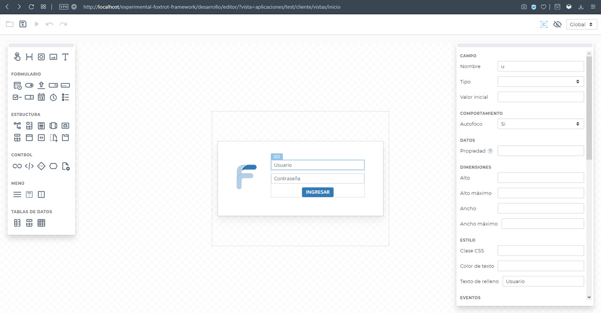

## Índice

- [Introducción](../README.md)
- [Primeros pasos](primeros-pasos.md)
- [Estructura](estructura.md)
- [Descripción y documentación del API](api.md)
- [Editor](editor.md)
- [Componentes](componentes.md)
- [Desarrollo de componentes](componentes-estructura.md)
- [Scripts de compilación](scripts.md)

## Editor

Editor de vistas *WYSIWYG Drag&Drop*: Nuestro editor de vistas viejo trabajaba íntegramente con objetos y cada vista era dibujada en tiempo de ejecución. En esta versión, buscamos un editor que "compile" la vista, almacenándola en HTML/CSS, pero sin perder la relación entre elementos del DOM y los objetos del framework. Debe, además, permitir editar en la versión real de la vista, con todos sus estilos y cualquier otra maquetación que se añada externamente.

El editor también permite configurar visualmente estructuras de control (bucles, condicionales, etc.), variables (acceso a datos) e integraciones con los controladores JS y PHP de la vista.

El el futuro, debe también ofrecer la posibilidad de construir controladores vinculados al origen de datos automáticamente mediante programación visual o un lenguaje imperativo simple, incluyendo validaciones y llamados a funciones PHP/JS para procesos específicos más complejos. Contará, además, con asistentes para creación de vistas y controladaores (por ejemplo, un ABMC en base al modelo de datos.)

El editor se acerca a su versión final. En líneas generales, falta (entre otros detalles y TODOs):
- Barra de formatos (negrita, cursiva, etc.) al editar textos.
- Determinar si un elemento puede ser hijo o no de otro al arrastrar y soltar (actualmente cualquier componente puede soltarse dentro de cualquier componente).

La siguiente etapa consistirá en:
- Definición de nuevas propiedades comunes a todos los componentes.
- Completar el desarrollo de componentes concretos (ya están planteados los componentes básicos).
- Integración con un gestor de aplicaciones vistas, controladores, base de datos y configuración; finalización de los métodos de guardado/apertura (previsualización posiblemente se remueva, abrir y guardar, si se realiza el gestor externo, también).

### Acceso al editor

**Importante:** Es necesario deshabilitar todas las extensiones del navegador que puedan alterar el cuerpo de la página, como bloqueadores de publicidad y *trackers*.

`http://localhost/experimental-foxtrot-framework/desarrollo/editor/?apl=[aplicacion]&vista=[nombre]`

Ejemplo: http://localhost/experimental-foxtrot-framework/desarrollo/editor?apl=ejemplo&vista=inicio

`apl` Nombre de la aplicación.

`vista` Ruta sin extensión relativa al directorio de vistas (`/desarrollo/aplicaciones/apl/cliente/vistas/`).

*Nota:* El editor solo está probado en la última versión de Opera.

#### Crear una nueva vista

Al crear una vista, dos parámetros adicionales deben agregarse a la URL del editor:

`modo`:
- `embebible` Almacenará solo el cuerpo de la vista, sin los tags `<html>`, `<head>`, `<body>`, scripts ni estilos, a fin de que sea una vista para insertar dentro de otra en tiempo de ejecución.
- `independiente` Almacenará la vista en un archivo HTML que podrá abrirse en forma independiente (Predeterminado).

`cliente`:
- `web` Almacenará la vista para funcionar en un servidor web (Predeterminado).
- `cordova` Al guardar, generará un archivo HTML compatible con Cordova.
- `escritorio` Al guardar, generará un archivo HTML compatible con el cliente de escritorio de Foxtrot.

Ejemplo: http://localhost/experimental-foxtrot-framework/desarrollo/editor?apl=ejemplo&vista=inicio&modo=independiente&cliente=cordova

En el futuro, `/desarrollo/editor/` se reemplazará por el gestor completo de aplicaciones y se automatizará el acceso al editor (acceso directo desde el listado de vistas).

### ¡Importante!

Actualmente, el editor está en desarrollo y está pensado para uso personal en un servidor local, por lo que no presenta ningún tipo de seguridad. **Implementar el editor en un servidor público o compartido deja abierta la posibilidad de cargar código arbitrario**.

En el futuro, el gestor de aplicaciones puede llegar a contar con autenticación de usuarios y mecanismos de seguridad para trabajo en servidores de desarrollo en línea (o en intranet).

### Consejos útiles

- Al arrastrar un componente sobre otro, tanto si se trata de uno nuevo o se está moviendo uno existente, esperando 1 segundo aparecerán áreas alrededor del componente para poder soltarlo antes/arriba o después/debajo del componente de destino.

- Para seleccionar un componente sobre el cual no se puede hacer click, haciendo click secundario sobre uno de sus hijos se desplegará un menú contextual con opciones para seleccionar cualquier componente en su ascendencia.

- Pueden seleccionarse múltiples componetes manteniendo presionada la tecla Shift.

- Cuando se seleccionen múltiples componentes, la barra de propiedades mostrará las propiedades combinadas de *todos* ellos, pero no mostrará ningún valor. Cualquier modificación en las propiedades, será aplicada por igual a todos los componentes seleccionados.

- Para copiar o cortar los componentes seleccionados pueden utilizarse los comandos de la barra de herramientas o presionar Ctrl+C / Ctrl+V. Asimismo, para pegar los componentes copiados, luego de seleccionar el destino o el cuerpo de la vista, se debe hacer click en el comando correspondiente o presionar Ctrl+V. *Es posible copiar entre distintas ventanas*.

## Más información

contacto@foxtrot.ar

www.foxtrot.ar

Licencia: Apache 2.0
